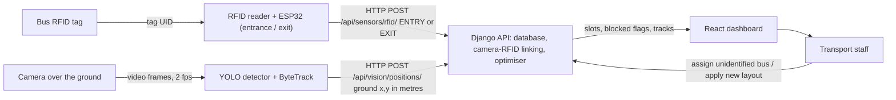

# Rathinam Smart Bus Parking

**AI Immersion Task 01 (C29) · Rathinam Technical Campus**

A full-stack cyber-physical system connecting physical RFID sensing, ultrasonic slot detection,
and constraint-based departure optimisation to prevent blocked buses and empower students with
real-time locator look-up.

🚌 **Live Demo:** [rathinam-transport-system.vercel.app](https://rathinam-transport-system.vercel.app)

- **Frontend (React + Vite):** Deployed on [Vercel](https://vercel.com) — `rathinam-transport-system.vercel.app`
- **Backend (Django REST Framework):** Deployed on [Railway](https://railway.app) — PostgreSQL database included
- **Admin Panel:** [rathinam-transport-system.vercel.app/admin](https://rathinam-transport-system.vercel.app/admin)
- **API Docs (Swagger):** [rathinam-transport-system.vercel.app/api/docs](https://rathinam-transport-system.vercel.app/api/docs)

---

## The Problem

The campus bus ground has no painted slots. Buses park wherever there is space,
so a bus that must leave early is often boxed in behind buses that leave later. Drivers and staff
then spend time finding the owner of the blocking bus and shuffling vehicles.

---

## Architecture



| Layer | Technology |
|---|---|
| Identification | RC522 (demo) or UHF (production) RFID + ESP32 |
| Localisation | YOLO (Ultralytics) + ByteTrack, image-to-ground homography |
| Backend | Django, Django REST Framework, JWT auth, PostgreSQL (Railway) |
| Frontend | React + TypeScript + Vite (Vercel) |
| Optimisation | Rule-based departure-time ordering |

---

## Live Deployment

| Service | URL |
|---|---|
| 🌐 Dashboard | https://rathinam-transport-system.vercel.app/dashboard |
| 🗺️ Parking Map | https://rathinam-transport-system.vercel.app/dashboard/parking |
| 🔍 Student Bus Finder | https://rathinam-transport-system.vercel.app/find |
| 🔧 Admin Panel | https://rathinam-transport-system.vercel.app/admin |
| 📄 API Docs | https://rathinam-transport-system.vercel.app/api/docs |

### Default Login (Demo)
| Role | Username | Password |
|---|---|---|
| Administrator | tom | (contact admin) |

---

## Parking Ground Layout

```
ENTRY / EXIT  ←  Gates A · B · C · D

Row A  [A1][A2][A3][A4][A5][A6][A7][A8][A9][A10]   ← Bus parking (IN/OUT gate)
Row B  [🚗🚗🚗][B4][B5][B6][B7][B8][B9][B10]       ← B1-B3: Cars & Bikes reserved
Row C  [🚗🚗🚗][C4][C5][C6][C7][C8][C9][C10]       ← C1-C3: Cars & Bikes reserved
Row D  [D1][D2][D3][D4][D5][D6][D7][D8][D9][D10]   ← Bus parking (IN/OUT gate)

Slot 1 = at the gate (open end)
```

- **40 total slots** — 34 bus slots + 6 reserved (cars & bikes)
- **15 active buses** (CAB 1 – CAB 20)
- A bus is **blocked** when another bus in a lower-numbered slot of the same row must move first

---

## Quick Start (Local)

### Backend

```bash
python -m venv venv
venv\Scripts\activate            # Windows PowerShell
pip install -r requirements.txt
python manage.py migrate
python manage.py createsuperuser
python manage.py create_slots --name "Rathinam Bus Ground" --length 60 --width 35 \
    --entrance-width 8 --exit-width 8 --rows 4 --slots-per-row 10
$env:DEVICE_API_KEY = "my-long-random-secret"
python manage.py runserver 0.0.0.0:8000
```

### Frontend

```bash
cd frontend
npm install
npm run dev          # http://localhost:3000
```

---

## API Reference

Base URL: `https://rathinam-transport-system.vercel.app/api/`
Interactive docs: `/api/docs/`

**Device endpoints** (need header `X-Device-Key: <DEVICE_API_KEY>`):

| Method | Path | Body |
|---|---|---|
| POST | `/sensors/rfid/` | `{"rfid_uid": "RFID-CAB-01", "sensor_id": "RFID-GATE-IN", "event_type": "ENTRY"}` |
| POST | `/sensors/occupancy/` | `{"sensor_id": "US-A1", "is_occupied": true, "slot_id": 1}` |
| POST | `/vision/positions/` | `{"camera_id": "CAM-1", "detections": [...]}` |

**Dashboard endpoints** (JWT auth; reads are public):

| Method | Path | Purpose |
|---|---|---|
| POST | `/auth/login/` | JWT login |
| GET/POST | `/buses/` | List / add buses |
| GET | `/parking/slots/` | All slot states |
| GET | `/parking/summary/` | Free / occupied / blocked counts |
| POST | `/optimization/run/` | Get recommended layout |
| POST | `/optimization/apply/` | Apply recommended layout |

---

## Data Model

| Model | Key fields |
|---|---|
| `Bus` | `bus_number`, `rfid_uid`, `route`, `departure_time`, `length_m`, `width_m` |
| `ParkingGround` | `length_m`, `width_m`, `entrance_width_m`, `exit_width_m`, `total_slots` |
| `ParkingSlot` | `row`, `slot_number`, `x_position_m`, `y_position_m`, `bus`, `is_occupied`, `is_blocked` |
| `Sensor` | `sensor_id`, `sensor_type` (RFID / ULTRASONIC / CAMERA), `location`, `last_seen` |
| `ParkingEvent` | `bus`, `sensor`, `parking_slot`, `event_type`, `message`, `timestamp` |
| `VisionTrack` | `camera_id`, `track_id`, `bus`, `slot`, `x_m`, `y_m`, `confidence`, `is_active` |
| `OptimizationResult` | current vs recommended layout, blocked before/after, movements |

---

## Features

- 🗺️ **3D & 2D Parking Map** — live slot status with bus info on hover
- 🔍 **Student Bus Finder** — search by bus number, slot, or RFID
- 📊 **Dashboard** — metrics, slot utilisation, bus route distribution
- 🔔 **Announcements** — transport staff broadcast notices
- ⚡ **Optimisation Engine** — recommends departure-time-sorted layout
- 📡 **Sensor Monitoring** — RFID gate, camera, ultrasonic status
- 💬 **Complaints & Feedback** — student submission system
-  **Attendance** — Checks absence or presence. 
- 👤 **Role-based access** — Admin / Staff / Student

---

## Project Structure

```
config/          Django settings and URLs
accounts/        JWT auth, roles, permissions
buses/           Bus model + API
parking/         Ground, slots, blocked-slot logic
sensors/         Sensor registry, RFID + occupancy endpoints
vision/          Camera tracking: models, API, linking
optimization/    Departure-time optimiser
announcements/   Notices
edge/            vision_tracker.py (YOLO), calibration
hardware/        ESP32 sketches + HARDWARE.md
frontend/        React + TypeScript dashboard (Vite)
```

---

## Deployment Stack

| Layer | Service | Notes |
|---|---|---|
| Frontend | Vercel (Hobby) | Auto-deploys from `main` branch |
| Backend | Railway | Django + Gunicorn, PostgreSQL addon |
| Database | Railway PostgreSQL | Persistent postgres-volume |
| Static files | Served by Django via WhiteNoise | |

### Environment Variables (Railway)

| Variable | Purpose |
|---|---|
| `DJANGO_DEBUG` | Set to `0` in production |
| `DJANGO_SECRET_KEY` | Long random string |
| `DEVICE_API_KEY` | Shared secret for ESP32 + camera |
| `DATABASE_URL` | Auto-set by Railway PostgreSQL addon |
| `DJANGO_ALLOWED_HOSTS` | Production hostname |

---

## Testing

```bash
python manage.py test                       # 61 backend tests
cd edge && python -m unittest test_geometry # calibration maths
cd frontend && npm run build                # type-check + build
```

---

## Known Limitations

- YOLO on the real ground is untested — measure real accuracy before submitting
- Identity matching is by arrival order — two buses entering together can be swapped
- RC522 RFID reads only ~3-5 cm — use UHF for buses driving through a gate
- SQLite used locally; PostgreSQL used in production (Railway)
- Optimiser fills row A first — spreading across rows is a known improvement

---

## AI Usage Declaration

| Tool | Purpose |
|---|---|
| Claude (Anthropic) | System design, backend logic, frontend components, debugging |
| YOLO (Ultralytics) | Bus detection from camera frames |

---

*Rathinam Technical Campus · C29 · AI Immersion Task 01*
